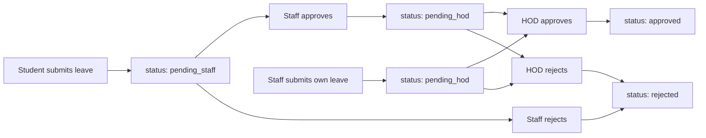

# Leave Management System — Walkthrough

## Overview

Implemented a complete **Leave Management System** by replicating the existing Gate Pass architecture. The system follows the exact same approval flow: **Student → Staff → HOD → Approval**.

---

## Firestore Structure

**Collection: `leave_requests`**

| Field | Type | Description |
|---|---|---|
| `studentId` | string | UID of the requester |
| `name` | string | Name of the requester |
| `email` | string | Email for notifications |
| `registerNo` | string | Register number (students only) |
| `department` | string | Department (matches `userProfile.dept`) |
| `year` | string | Year of study (students only) |
| `phone` | string | Contact phone |
| `fromDate` | string | Leave start date |
| `toDate` | string | Leave end date |
| `reason` | string | Reason text |
| `leaveType` | string | Sick Leave, Personal Leave, etc. |
| `role` | string | `"student"` or `"staff"` |
| `status` | string | `"pending_staff"` / `"pending_hod"` / `"approved"` / `"rejected"` |
| `createdAt` | string | ISO timestamp |
| `staffName` | string | Staff who approved (added on approval) |
| `staffActionAt` | string | When staff acted |
| `hodName` | string | HOD who approved (added on approval) |
| `hodActionAt` | string | When HOD acted |

---

## Approval Flow

---

## Files Changed

### New Files Created

| File | Purpose |
|---|---|
| [Leave.js](file:///c:/Users/balam/OneDrive/Desktop/college%20ERP/College-ERP/src/pages/student/Leave.js) | Student leave form + history |
| [Leave.js](file:///c:/Users/balam/OneDrive/Desktop/college%20ERP/College-ERP/src/pages/staff/Leave.js) | Staff: approve student leaves + own leave form + history |
| [Leave.js](file:///c:/Users/balam/OneDrive/Desktop/college%20ERP/College-ERP/src/pages/hod/Leave.js) | HOD: approve student + staff leaves, view history |

### Modified Files

| File | Changes |
|---|---|
| [App.js](file:///c:/Users/balam/OneDrive/Desktop/college%20ERP/College-ERP/src/App.js) | Added 3 imports + 3 routes (`/student/leave`, `/staff/leave`, `/hod/leave`) |
| [Sidebar.js](file:///c:/Users/balam/OneDrive/Desktop/college%20ERP/College-ERP/src/components/Sidebar.js) | Added "📋 Leave" nav item to student, staff, and hod nav arrays |

---

## Key Features by Role

### Student (`/student/leave`)
- **Apply Tab**: Leave form with leaveType, reason, fromDate, toDate, and auto-calculated duration
- **History Tab**: All submitted leaves with status badges
- On submit: saves to `leave_requests` with `role: "student"`, `status: "pending_staff"`
- Sends email notification to all staff in their department

### Staff (`/staff/leave`)
- **Student Leaves Tab**: Shows `pending_staff` requests from their department, with Approve/Reject buttons
- **Apply My Leave Tab**: Staff's own leave form (submits with `role: "staff"`, `status: "pending_hod"`)
- **My Leaves Tab**: Staff's own leave history with status badges
- On approve: updates to `pending_hod`, emails HOD
- On reject: updates to `rejected`, emails student

### HOD (`/hod/leave`)
- **Student Leaves Tab**: Shows `pending_hod` + `role: "student"` requests
- **Staff Leaves Tab**: Shows `pending_hod` + `role: "staff"` requests
- **Approved Tab**: All approved leave records with role badges
- Stats card showing pending counts for student/staff and total approved
- Sort controls (Recent First / Oldest First)
- On approve: updates to `approved`, emails requester
- On reject: updates to `rejected`, emails requester

---

## Verification

- ✅ Production build completed successfully (exit code 0)
- ✅ All existing Gate Pass routes and components untouched
- ✅ Consistent UI with existing card/badge design system
